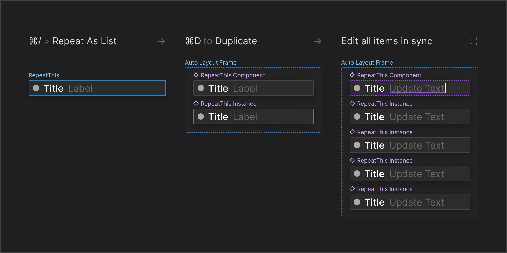

#  Repeat as List

1. Creates a component from your current selection
2. Wraps that component in an Auto Layout frame with another instance
3. Mash `⌘D` to Duplicate the instance as many times as needed
4. Editing the first item in the list will keep the rest in sync

Works like [Adobe XDs repeat grid](https://www.adobe.com/lu_en/products/xd/features/repeat-grid.html) (but only in a vertical stack). This use case is very common during rapid ideation or digital white boarding.

[Install the Plugin from Figma Community](https://www.figma.com/community/plugin/1201323323265727466)
